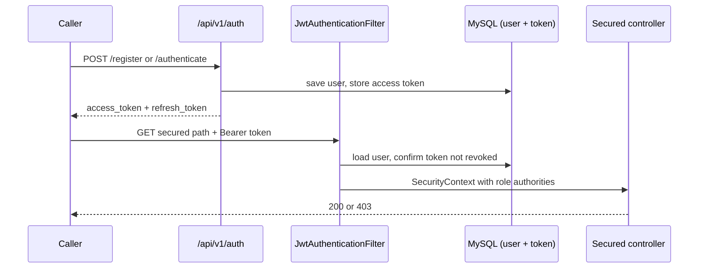
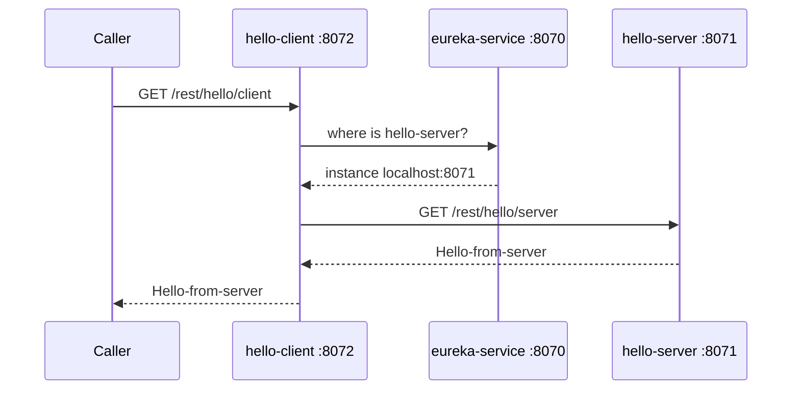

  

<h1 align="center">Rakesh Kumar</h1>

  

  10+ years building Java backend systems — Spring Boot microservices, event-driven services, and secure REST APIs. 
  Focused on service discovery, JWT authorization, and cloud-native delivery.

  
  
  
  

---

## Engineering Focus

| Area | What I work on |
| --- | --- |
| **Microservices** | Independently deployable Spring Boot services that register with Eureka and call each other by name, not host. |
| **Application security** | JWT access and refresh tokens, token revocation on logout, and role/permission checks (`USER`, `MANAGER`, `ADMIN`). |
| **Event-driven systems** | REST endpoints that publish to Apache Kafka topics; RabbitMQ producer to a named exchange. |
| **Java / JVM** | Modern Java (11/17/21), Spring Boot 3/4, and virtual-thread vs platform-thread execution. |
| **API design** | Versioned REST APIs, OpenAPI/Swagger, RFC 7807 error bodies, Spring Data JPA. |
| **Cloud-native delivery** | Docker Compose for local data stores, GitHub Actions to Azure, Maven-based CI. |

---

## Technology Stack

**Languages**  
`Java 11 / 17 / 21` · `TypeScript` · `C`

**Backend**  
`Spring Boot` · `Spring Security` · `Spring WebFlux` · `Spring Data JPA` · `Hibernate`

**Architecture & messaging**  
`Microservices` · `Netflix Eureka` · `REST` · `Apache Kafka` · `RabbitMQ` · `SOAP / WSDL`

**Data**  
`MySQL` · `Apache Cassandra` · `H2`

**Cloud, containers & delivery**  
`Docker` · `Microsoft Azure` · `GitHub Actions` · `Jenkins` · `Maven`

**Security**  
`JWT (HS256)` · `BCrypt` · `method-level authorization`

**Testing & API docs**  
`JUnit 5` · `Mockito` · `MockMvc` · `springdoc-openapi`

  

---

## Featured Projects

### Spring Boot 3 JWT Security
JWT-based stateless API authentication with refresh tokens, logout revocation, and role-based authorization.

`Java 21` `Spring Boot 4` `Spring Security` `JWT` `MySQL` `JPA` `OpenAPI`

[View repository →](https://github.com/Rakesh4ever/spring-boot-3-jwt-security)

### Microservices Intercommunication
Three Spring Boot services: a Eureka registry, a provider, and a consumer that resolves `hello-server` through a load-balanced `RestTemplate`.

`Spring Cloud` `Eureka` `REST` `Ribbon` `JUnit`

[View repository →](https://github.com/Rakesh4ever/micro-services)

### Kafka Producer
REST endpoint that publishes messages onto an Apache Kafka topic (`kafkaTopic`) after ZooKeeper and the broker are up.

`Spring Kafka` `REST` `Apache Kafka`

[View repository →](https://github.com/Rakesh4ever/KafkaProducer)

### Java Virtual Threads
Compares launch cost of 100,000 virtual threads vs platform threads using `Thread.ofVirtual()` and `Thread.ofPlatform()`.

`Java` `Project Loom` `Concurrency`

[View repository →](https://github.com/Rakesh4ever/JavaVirtualThreads)

### Reactive Cassandra POC
Spring WebFlux + WebClient service that persists entities to Apache Cassandra (Java 11, Spring Boot 2.x).

`WebFlux` `WebClient` `Cassandra` `Swagger`

[View repository →](https://github.com/Rakesh4ever/POC)

### Products
- **[FinanceControl.net](https://financecontrol.net)** — personal-finance platform (budget, SIP, tax, and FX tools).
- **[Tithi.Live](https://tithi.live)** — city-aware Hindu panchang (tithi, nakshatra, rahu kaal, muhurta).

---

## Architecture

Two public repos with the clearest request paths. Components match the code and READMEs — nothing invented.

### JWT security request path

  

### Service discovery call path

  

---

## GitHub Activity

  <picture>
    <source media="(prefers-color-scheme: dark)" srcset="https://github-readme-stats-anuraghazra1.vercel.app/api?username=Rakesh4ever&show_icons=true&theme=tokyonight&hide_border=true">
    <source media="(prefers-color-scheme: light)" srcset="https://github-readme-stats-anuraghazra1.vercel.app/api?username=Rakesh4ever&show_icons=true&theme=default&hide_border=true">
    
  </picture>
  <picture>
    <source media="(prefers-color-scheme: dark)" srcset="https://github-readme-stats-anuraghazra1.vercel.app/api/top-langs/?username=Rakesh4ever&layout=compact&theme=tokyonight&hide_border=true">
    <source media="(prefers-color-scheme: light)" srcset="https://github-readme-stats-anuraghazra1.vercel.app/api/top-langs/?username=Rakesh4ever&layout=compact&theme=default&hide_border=true">
    
  </picture>

---

## Currently Exploring

- Modern Java and JVM execution models (virtual threads, Spring Boot 4)
- Distributed-system design around service discovery and messaging
- Cloud-native backend delivery
- AI-assisted software engineering

---

## Certifications & Continuous Learning

Public LinkedIn credentials. Skill assessments are LinkedIn Skill Assessments, not vendor professional exams.

| Certification | Issuer | Year |
| --- | --- | --- |
| [Java](https://www.linkedin.com/in/rakesh-kumar/detail/assessments/Java/report/) | LinkedIn | 2019 |
| [Spring Framework](https://www.linkedin.com/in/rakesh-kumar/detail/assessments/Spring%20Framework/report/) | LinkedIn | 2020 |
| [MySQL](https://www.linkedin.com/in/rakesh-kumar/detail/assessments/MySQL/report/) | LinkedIn | 2020 |
| [Simplifying data pipelines with Apache Kafka](https://courses.cognitiveclass.ai/certificates/4a715cc938e049c38a12034a74a572b7) | IBM Cognitive Class | 2018 |
| [Hadoop Programming](https://www.linkedin.com/in/rakesh-kumar/details/certifications/) | IBM | 2018 |
| [Angular](https://www.linkedin.com/in/rakesh-kumar/detail/assessments/Angular/report/) | LinkedIn | 2021 |

---

## Let's Connect

I'm interested in backend engineering, distributed systems, Java platform work, and cloud-native architecture.

  <a href="https://www.linkedin.com/in/rakesh-kumar">LinkedIn</a>
  ·
  <a href="https://github.com/Rakesh4ever">GitHub</a>
  ·
  <a href="https://financecontrol.net">FinanceControl.net</a>
  ·
  <a href="https://tithi.live">Tithi.Live</a>

